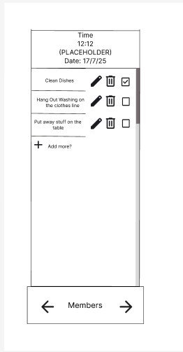

# Sprint 1 - A Working UI Prototype

## Sprint Goals

Develop a prototype that simulates the key functionality of the system, then test and refine it so that it can serve as the model for the next phase of development in Sprint 2.

[Figma](https://www.figma.com/) is used to develop the prototype.

---

## Initial Database Design

Replace this text with notes regarding the DB design.
this app will be the creation of a chore/task list, which can be edited with.
this design will have 3 pages, each with their own purpose.
first, the main page is used to make, add, delete, or edit chores set by the party leader.
the second, is the party page, you will be able to make multiple party's and either be a member, or host one. you may view and edit your own party, and set specific tasks/chores to them.
the third page will require prior use of both other tabs. this tab is called the history tab, it allows anyone in the party to see who checked off a chore, the date and time of its completion too.

---

## UI 'Flow'

The first stage of prototyping was to explore how the UI might 'flow' between states, based on the required functionality.

This Figma demo shows the initial design for the UI 'flow':

**FIGMA FLOW - PLACE THE FIGMA EMBED CODE HERE - MAKE SURE IT IS SET SO THAT EVERYONE CAN ACCESS IT**

### Testing

Replace this text with notes about what you did to test the UI flow and the outcome of the testing.

### Changes / Improvements

Replace this text with notes any improvements you made as a result of the testing.

*IMPROVED FIGMA FLOW - PLACE THE FIGMA EMBED CODE HERE - MAKE SURE IT IS SET SO THAT EVERYONE CAN ACCESS IT*

---

## Initial UI Prototype

The next stage of prototyping was to develop the layout for each screen of the UI.

This Figma demo shows the initial layout design for the UI:

*FIGMA PROTOTYPE - PLACE THE FIGMA EMBED CODE HERE - MAKE SURE IT IS SET SO THAT EVERYONE CAN ACCESS IT*

### Testing

Replace this text with notes about what you did to test the UI flow and the outcome of the testing.

### Changes / Improvements

Replace this text with notes any improvements you made as a result of the testing.

*FIGMA IMPROVED PROTOTYPE - PLACE THE FIGMA EMBED CODE HERE - MAKE SURE IT IS SET SO THAT EVERYONE CAN ACCESS IT*

---

## Refined UI Prototype

Having established the layout of the UI screens, the prototype was refined visually, in terms of colour, fonts, etc.

This Figma demo shows the UI with refinements applied:

*FIGMA REFINED PROTOTYPE - PLACE THE FIGMA EMBED CODE HERE - MAKE SURE IT IS SET SO THAT EVERYONE CAN ACCESS IT*

### Testing

Replace this text with notes about what you did to test the UI flow and the outcome of the testing.

### Changes / Improvements

Replace this text with notes any improvements you made as a result of the testing.

*FIGMA IMPROVED REFINED PROTOTYPE - PLACE THE FIGMA EMBED CODE HERE - MAKE SURE IT IS SET SO THAT EVERYONE CAN ACCESS IT*

---

## Sprint Review

Replace this text with a statement about how the sprint has moved the project forward - key success point, any things that didn't go so well, etc.

